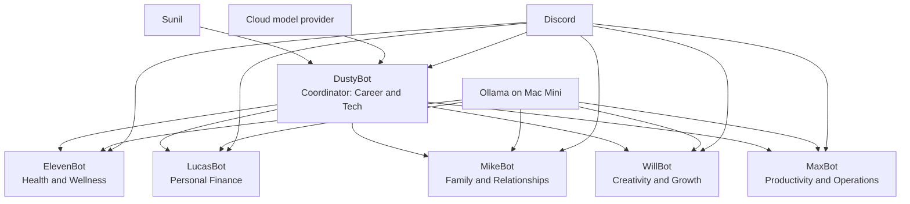

# From a Bare Mac Mini to a Six-Agent AI Server

How I built a personal AI org chart with Hermes Agent, Discord, Ollama, cloud models, and open models.

> Last verified: July 19, 2026
>
> Hermes Agent and Ollama change quickly. I verified the workflow below against the current official documentation on the date above. Check the linked documentation before rerunning commands later.

## What I Built

I started with a new Apple Silicon Mac Mini and ended the day with six Hermes agents in six Discord channels:

- **DustyBot**: coordinator, career, and technology
- **ElevenBot**: health and wellness
- **LucasBot**: personal finance
- **MikeBot**: family and relationships
- **WillBot**: creativity and personal growth
- **MaxBot**: productivity and daily operations

DustyBot sits at the top because it knows which specialist to call, not because it outranks the others.

The deployed system is **hybrid**, not fully local. I used a cloud model for some work and open-weight models through Ollama for other work. Hermes stores its configuration, conversations, memories, and skills locally, but prompts sent to a cloud model still leave the machine and are handled under that provider's terms.

The important lesson was not how to launch six bots. It was how quickly a model experiment became a management system involving roles, context, permissions, routing, supervision, and accountability.

## Architecture



This chart maps routing and specialization. It does not grant any agent independent authority over money, medical decisions, messages, or production systems.

## Start With Two, Not Six

I built six because I wanted to understand the operating model. If you are doing this for the first time, build only:

1. One coordinator.
2. One specialist with a narrow recurring job.

Get both working reliably before adding another profile. Every additional agent adds another identity, token, configuration, gateway, context boundary, and failure surface.

## Before You Begin

You need:

- An Apple Silicon Mac running a supported version of macOS
- A temporary keyboard and display for the Mac's first setup
- A Discord account and a private Discord server
- A text editor
- A password manager for bot tokens and API keys
- Optional: a cloud model account
- Optional: Tailscale for private remote access
- Optional: Ollama for local open-weight models

This guide assumes you are comfortable opening Terminal and pasting commands. Read every command before running it.

## 1. Prepare the Mac Mini

Complete macOS setup, install system updates, and create a dedicated user account for the server.

Turn on Screen Sharing:

1. Open **System Settings > General > Sharing**.
2. Turn on **Screen Sharing**.
3. Limit access to the user accounts that need it.

From another Mac, open the Screen Sharing app or use Finder's Network view to connect. Apple documents the current process in [Turn Mac screen sharing on or off](https://support.apple.com/guide/mac-help/mh11848/mac).

### Optional: add Tailscale

Screen Sharing works on the same local network. Tailscale lets your authorized devices reach the Mac Mini through a private tailnet when you are away.

Use Tailscale's [official macOS installation guide](https://tailscale.com/docs/install/mac). Tailscale currently recommends its standalone macOS app for most users.

Do not expose Screen Sharing or Hermes directly to the public internet.

## 2. Install Hermes Agent

Use the current installer from the Hermes Agent quickstart:

```bash
curl -fsSL https://hermes-agent.nousresearch.com/install.sh | bash
```

Open a new Terminal window, then verify the installation:

```bash
hermes version
```

Run the setup flow:

```bash
hermes setup
```

Hermes keeps normal settings in `~/.hermes/config.yaml` and secrets in `~/.hermes/.env`.

> Do not commit `.env`, bot tokens, API keys, auth files, memories, or conversation history to GitHub.

## 3. Choose the Model Architecture

Hermes can use a hosted model, a local OpenAI-compatible endpoint, or both across separate profiles.

### Option A: hosted model

Run:

```bash
hermes model
```

Select the provider you use and complete its authentication flow. Hosted models are usually the simplest way to get a reliable first agent working.

### Option B: local model through Ollama

Install Ollama from [ollama.com](https://ollama.com), then pull a model that supports the work you intend to delegate.

Example model tags from my build included Qwen, Gemma, and Llama variants:

```bash
ollama pull qwen3:14b
ollama pull gemma3
ollama pull llama3.2:3b
```

Model tags, memory requirements, and tool-calling quality change. Treat these as build-record examples, not universal recommendations.

### Set enough local context

Hermes currently requires at least 64,000 tokens of context for agent workflows. Ollama may allocate less by default based on available memory.

Start Ollama with a 64K context window:

```bash
OLLAMA_CONTEXT_LENGTH=64000 ollama serve
```

Then confirm the effective allocation:

```bash
ollama ps
```

The `CONTEXT` column should show at least `64000` for the loaded model. A larger context window consumes more memory, so watch system pressure and use a smaller model if necessary.

Configure Hermes:

```bash
hermes model
```

Choose **Custom endpoint**, then enter:

```text
Base URL: http://localhost:11434/v1
API key: leave blank
Model: the exact Ollama tag you pulled
Context length: 64000
```

The [Hermes provider guide](https://github.com/NousResearch/hermes-agent/blob/main/website/docs/integrations/providers.md) explains the current Ollama integration and context requirement.

## 4. Create a Private Discord Server

Create a server in Discord for your agents. I used one dedicated channel per agent because it made domain boundaries visible:

```text
#career-tech
#health-wellness
#financials
#family
#creative
#productivity
```

For a two-agent pilot, create only two channels.

## 5. Create the First Discord Bot

Go to the [Discord Developer Portal](https://discord.com/developers/applications) and create an application.

For the application:

1. Open **Bot** and generate a bot token.
2. Store the token in a password manager immediately.
3. Enable **Message Content Intent** if the bot must read ordinary message text.
4. Under installation settings, grant only the permissions the bot needs.
5. Install the bot in your private server.

Never paste a bot token into a document, screenshot, chat, or Git repository. If a token is exposed, reset it in the Developer Portal.

Discord's [official bot quickstart](https://docs.discord.com/developers/quick-start/getting-started) explains applications, tokens, intents, scopes, and permissions.

## 6. Connect Hermes to Discord

Run the guided gateway setup:

```bash
hermes gateway setup
```

Choose Discord and provide:

- The bot token
- Your Discord user ID
- The channel ID, when requested

To copy IDs in Discord, enable **Developer Mode** under Settings, then right-click the user or channel.

Install and start the macOS background service:

```bash
hermes gateway install
hermes gateway start
hermes gateway status
```

Send a message in Discord and confirm that the agent answers before continuing.

### The setting that defeated me

One of my bots appeared online but ignored every message. The missing setting was `DISCORD_ALLOWED_USERS`.

Hermes denies all users by default when neither allowed users nor allowed roles are configured. Confirm that the profile's `.env` contains your Discord user ID:

```text
DISCORD_ALLOWED_USERS=your_discord_user_id
```

Then restart that profile's gateway.

The current [Hermes Discord guide](https://github.com/NousResearch/hermes-agent/blob/main/website/docs/user-guide/messaging/discord.md) documents this behavior and the full troubleshooting flow.

## 7. Define the First Agent's Job

Edit the default profile's identity file:

```text
~/.hermes/SOUL.md
```

Keep it short. Define:

- The agent's role
- What it owns
- What it must not do
- Its communication style
- When it should ask you to decide

Example:

```markdown
# Coordinator

You coordinate career and technology work.

## Responsibilities
- Clarify the request before acting when the goal is ambiguous.
- Route specialist questions to the correct agent.
- Summarize the specialist's answer for the human owner.

## Boundaries
- Do not send messages, move money, or change external systems without approval.
- State uncertainty directly.
- The human owns every final decision.
```

`SOUL.md` defines durable identity. Use `AGENTS.md` or another project context file for task-specific instructions. See the [Hermes personality guide](https://github.com/NousResearch/hermes-agent/blob/main/website/docs/user-guide/features/personality.md).

## 8. Create the Second Profile

Profiles isolate configuration, credentials, sessions, memory, skills, gateway state, logs, and personality.

Create a fresh specialist profile:

```bash
hermes profile create specialist
```

Hermes normally creates a shortcut command using the profile name. Configure the profile's model and Discord gateway:

```bash
specialist model
specialist gateway setup
specialist gateway install
specialist gateway start
specialist gateway status
```

Use a **different Discord application and token** for the second profile.

Edit its identity here:

```text
~/.hermes/profiles/specialist/SOUL.md
```

Do not assume a fix to the default profile repairs the specialist. Profile isolation is the point, and it also means configuration changes may need to be repeated.

The [Hermes profiles guide](https://github.com/NousResearch/hermes-agent/blob/main/website/docs/user-guide/profiles.md) documents the current profile model and commands.

## 9. Give Each Agent One Home Channel

In a private server, a dedicated channel can act as the agent's home.

By default, Hermes can require an `@mention` in server channels. To let one bot respond freely in its own channel, add that channel ID to the profile's Discord configuration:

```yaml
discord:
  require_mention: true
  free_response_channels:
    - 123456789012345678
```

Use only the channel assigned to that profile. In multi-bot channels or threads, require explicit mentions to avoid every bot responding to the same message.

## 10. Expand From Two to Six

Only expand after the first two agents pass the same acceptance test:

- The correct user can invoke the bot.
- Unauthorized users cannot.
- The bot responds only in its intended channel or when explicitly mentioned.
- The model has enough context.
- The agent can explain its role and boundaries.
- A gateway restart does not lose configuration.
- You know which human owns the result.

Then repeat the profile and Discord setup for each specialist:

```bash
hermes profile create eleven
hermes profile create lucas
hermes profile create mike
hermes profile create will
hermes profile create max
```

For each profile:

1. Create a unique Discord application and token.
2. Configure its model.
3. Run its gateway setup.
4. Set its allowed user.
5. Assign one free-response channel.
6. Write its `SOUL.md`.
7. Install and start its gateway.
8. Test it before creating the next profile.

See all profile gateways at once:

```bash
hermes gateway list
```

## 11. Make Coordination Explicit

My coordinator knows the specialists' names, domains, and channels. That makes routing legible, but it is not magic autonomous collaboration.

Put a compact roster in the coordinator's `SOUL.md`:

```markdown
## Specialists

- ElevenBot: health and wellness
- LucasBot: personal finance
- MikeBot: family and relationships
- WillBot: creativity and growth
- MaxBot: productivity and operations

When a request belongs to a specialist, name the specialist and explain why.
Do not pretend another agent was consulted unless an actual tool or workflow did so.
```

The distinction matters: a routing metaphor is not the same as verified inter-agent execution.

## 12. The Five-Layer Management Test

Before delegating recurring work, define:

| Layer | Question |
|---|---|
| Role | What does the agent own? |
| Context | What must it know? |
| Authority | What may it access and do? |
| Supervision | How will work and exceptions be observed? |
| Accountability | Which human owns the outcome? |

The model can change. This management design should survive the swap.

## What Broke in My Build

### Bot is online but ignores messages

Check, in this order:

1. `DISCORD_ALLOWED_USERS` contains your correct numeric user ID.
2. Message Content Intent is enabled in the Discord Developer Portal.
3. The bot can view the channel, read message history, and send messages.
4. You restarted the correct profile's gateway.
5. Mention requirements and free-response channel settings match your design.

### Local conversations fail as they grow

My local models loaded a 40,960-token context while Hermes expected at least 64,000. Match both sides and verify the effective Ollama allocation with:

```bash
ollama ps
```

### Fixing one agent does not fix the others

Each profile is isolated. Check the active profile's home and configuration:

```bash
hermes profile show specialist
```

Apply and test changes profile by profile.

### Multiple local models feel slow

Switching between model families may force Ollama to load and unload weights. Begin with one local model shared by the specialist profiles. Add more only when a measured task benefits from them.

## Security and Privacy Checklist

- Keep the Discord server private.
- Restrict `DISCORD_ALLOWED_USERS` or allowed roles.
- Use one token per bot and one bot per profile.
- Grant the minimum Discord permissions required.
- Never commit `.env`, auth files, API keys, tokens, sessions, or memories.
- Do not expose Ollama, Hermes, Screen Sharing, or gateway ports publicly.
- Treat cloud-model prompts as data sent to that provider.
- Keep sensitive health and financial data out unless you have deliberately designed the privacy boundary.
- Do not give agents authority to send messages, move money, alter production systems, or make consequential decisions without explicit controls.
- Rotate any credential that may have appeared in a screenshot or transcript.

## Maintenance

Check versions and available updates:

```bash
hermes version
hermes update --check
```

Before a major update, back up each profile or create an exported profile archive. Re-run the two-agent acceptance test after updates before trusting the larger system.

## Official References

- [Hermes Agent repository](https://github.com/NousResearch/hermes-agent)
- [Hermes quickstart](https://github.com/NousResearch/hermes-agent/blob/main/website/docs/getting-started/quickstart.md)
- [Hermes Discord setup](https://github.com/NousResearch/hermes-agent/blob/main/website/docs/user-guide/messaging/discord.md)
- [Hermes profiles](https://github.com/NousResearch/hermes-agent/blob/main/website/docs/user-guide/profiles.md)
- [Hermes model providers and Ollama](https://github.com/NousResearch/hermes-agent/blob/main/website/docs/integrations/providers.md)
- [Hermes personality and SOUL.md](https://github.com/NousResearch/hermes-agent/blob/main/website/docs/user-guide/features/personality.md)
- [Ollama context length](https://docs.ollama.com/context-length)
- [Discord bot quickstart](https://docs.discord.com/developers/quick-start/getting-started)
- [Tailscale for macOS](https://tailscale.com/docs/install/mac)
- [Apple Screen Sharing](https://support.apple.com/guide/mac-help/mh11848/mac)

## Final Note

The fun part was giving the agents Stranger Things names. The useful part was discovering that personality made specialization easier to remember.

The hard part was everything around the models: identities, permissions, context windows, isolated configuration, gateways, routing, and human accountability.

That is why I no longer think of this as six chatbots. It is a small, personal operating model for delegated work.
